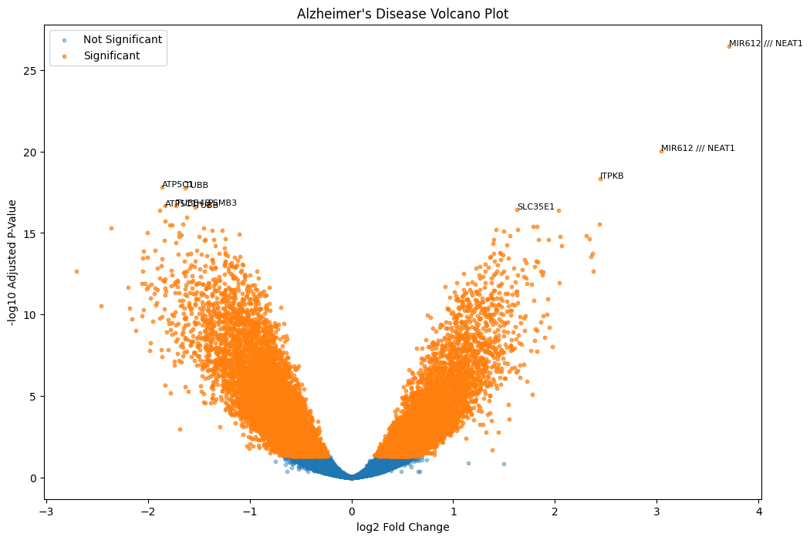

 Alzheimer's Transcriptomics Analysis

This project explores differential gene expression in Alzheimer's disease using public microarray transcriptomics datasets from GEO.

 Objectives

- Analyze Alzheimer's vs healthy brain samples
- Identify dysregulated genes
- Perform differential expression analysis using limma
- Visualize significant genes using volcano plots
- Explore molecular changes associated with Alzheimer's disease

 Dataset

- GEO Series: GSE5281
- Platform: GPL570

The dataset contains:
- Alzheimer's disease samples
- Healthy control brain samples

 Workflow

1. Download GEO dataset using GEOparse
2. Extract and clean metadata
3. Build expression matrix
4. Normalize data using log2 transformation
5. Perform differential expression analysis using limma
6. Annotate probes to gene symbols
7. Generate volcano plots

Technologies Used

Python
- pandas
- numpy
- matplotlib
- GEOparse

 R
- limma
- Bioconductor

Results

The analysis identified significantly dysregulated genes associated with Alzheimer's disease.

 Volcano Plot

 Future Work

- Pathway enrichment analysis
- Heatmaps
- Multi-omics integration
- Proteomics comparison
- Protein structure analysis

 Author

Pallawi Singh
